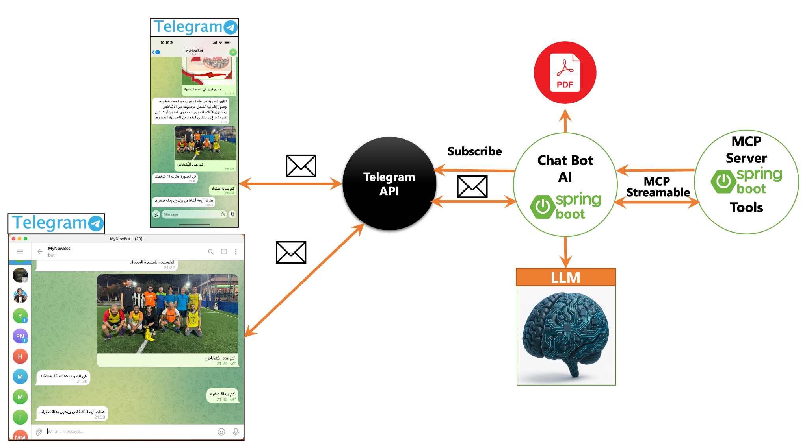

# Activité pratique N°2 — Chatbot Spring AI MCP Telegram

Projet réalisé à partir de l'activité proposée par **Pr. Mohamed YOUSSFI**.

Le projet couvre les trois parties demandées :

1. développement d'un chatbot Spring AI connecté à Telegram ;
2. ajout d'un système RAG pour interroger des fichiers PDF, TXT et Markdown ;
3. intégration du chatbot dans une architecture microservices avec Eureka, Gateway, Customer Service et Inventory Service.

Vidéo de référence : [Part 1 — AI Agent Chatbot With Spring AI MCP and Telegram Client](https://www.youtube.com/watch?v=Q12plqwksxk)

## Architecture



| Application | Port | Rôle |
|---|---:|---|
| `discovery-service` | 8761 | Registre Eureka |
| `gateway-service` | 8888 | Point d'entrée et routage |
| `customer-service` | 8081 | Données clients de démonstration |
| `inventory-service` | 8082 | Produits et stock de démonstration |
| `mcp-business-server` | 8989 | Exposition des outils métier via MCP Streamable HTTP |
| `chatbot-agent` | 8087 | Spring AI, OpenAI, mémoire, RAG, API REST et Telegram |

Le chemin d'une question métier est le suivant :

`Telegram → chatbot-agent → LLM → client MCP → serveur MCP → microservice métier → réponse`

## Technologies

- Java 21 ;
- Spring Boot 3.5 ;
- Spring Cloud, Eureka et Gateway ;
- Spring AI 1.1 ;
- OpenAI Chat Model et Embedding Model ;
- Model Context Protocol — Streamable HTTP ;
- Telegram Bots Java ;
- RAG avec `SimpleVectorStore` et lecture PDF ;
- Maven, JUnit 5 et Docker Compose.

## Organisation

```text
activite-pratique-2-chatbot-spring-ai-mcp-telegram/
├── chatbot-agent/          # Agent, mémoire, RAG, REST et Telegram
├── mcp-business-server/    # Serveur MCP et outils métier
├── customer-service/       # Microservice clients
├── inventory-service/      # Microservice produits/stock
├── discovery-service/      # Eureka Server
├── gateway-service/        # API Gateway
├── data/documents/         # Documents à indexer par le RAG
├── docs/images/            # Schéma d'architecture
├── scripts/                # Scripts PowerShell et Bash
├── docker-compose.yml
└── pom.xml                 # Projet Maven multi-module
```

## Configuration

### 1. Préparer le fichier `.env`

Sous PowerShell :

```powershell
Copy-Item .env.example .env
```

Sous Bash :

```bash
cp .env.example .env
```

Modifier ensuite `.env` :

```dotenv
OPENAI_API_KEY=sk-votre-cle-openai
OPENAI_CHAT_MODEL=gpt-4o-mini
OPENAI_EMBEDDING_MODEL=text-embedding-3-small
```

> La clé fournie dans Classroom ne doit jamais être ajoutée au code ou poussée sur GitHub.

### 2. Configurer Telegram

Dans Telegram, ouvrir **@BotFather**, exécuter `/newbot`, puis renseigner :

```dotenv
TELEGRAM_BOT_ENABLED=true
TELEGRAM_BOT_USERNAME=NomDeVotreBot
TELEGRAM_BOT_TOKEN=token-fourni-par-botfather
```

Pour tester uniquement l'API REST, conserver `TELEGRAM_BOT_ENABLED=false`.

## Lancement avec Docker

Prérequis : Java 21, Docker Desktop et Docker Compose.

```powershell
.\mvnw.cmd clean package
docker compose up --build
```

Ou exécuter le script complet :

```powershell
.\scripts\run.ps1
```

Interfaces utiles :

- Eureka : <http://localhost:8761>
- Gateway : <http://localhost:8888>
- état du chatbot : <http://localhost:8087/actuator/health>
- état du RAG : <http://localhost:8888/api/rag/status>

## Lancement manuel dans IntelliJ IDEA

Lancer les classes dans cet ordre :

1. `DiscoveryServiceApplication` ;
2. `CustomerServiceApplication` ;
3. `InventoryServiceApplication` ;
4. `McpBusinessServerApplication` ;
5. `ChatbotAgentApplication` ;
6. `GatewayServiceApplication`.

Ajouter les variables `OPENAI_API_KEY`, `TELEGRAM_BOT_ENABLED`, `TELEGRAM_BOT_USERNAME` et `TELEGRAM_BOT_TOKEN` dans la configuration d'exécution de `ChatbotAgentApplication`.

## Partie 1 — Utiliser le chatbot

### Question REST synchrone

```bash
curl -X POST http://localhost:8888/api/chat \
  -H "Content-Type: application/json" \
  -d '{"conversationId":"demo-1","message":"Quels produits ont un stock inférieur ou égal à 5 ?"}'
```

Le LLM sélectionne automatiquement l'outil MCP `listLowStockProducts`.

Le bot Telegram accepte également les images. Envoyer une photo avec une légende comme « Combien de personnes apparaissent dans cette image ? ». Le fichier est téléchargé depuis Telegram puis transmis au modèle multimodal configuré.

### Réponse en streaming

```bash
curl -N "http://localhost:8888/api/chat/stream?conversationId=demo-1&message=Présente%20les%20produits"
```

La mémoire est isolée par `conversationId`. Pour Telegram, le programme utilise `telegram:<chatId>` afin d'éviter de mélanger les conversations des utilisateurs.

## Partie 2 — RAG

Au démarrage, le chatbot indexe les documents présents dans `data/documents`. Il accepte les extensions `.pdf`, `.txt` et `.md`.

Pour ajouter un PDF pendant l'exécution :

```bash
curl -X POST http://localhost:8888/api/rag/index \
  -F "file=@mon-document.pdf"
```

Tester la recherche vectorielle :

```bash
curl "http://localhost:8888/api/rag/search?query=Quel%20est%20le%20port%20du%20serveur%20MCP&topK=4"
```

Puis poser la question au chatbot. Les fragments pertinents sont automatiquement ajoutés au contexte avant l'appel au modèle.

## Partie 3 — Intégration microservices

Le serveur MCP n'enregistre pas lui-même les données métier. Ses outils appellent les API des microservices :

| Outil MCP | Microservice appelé |
|---|---|
| `listCustomers` | `GET /api/customers` |
| `getCustomer` | `GET /api/customers/{id}` |
| `listProducts` | `GET /api/products` |
| `getProductStock` | `GET /api/products/{id}` |
| `listLowStockProducts` | `GET /api/products/low-stock` |

On peut remplacer les deux services de démonstration par ceux de l'activité pratique N°1 en modifiant seulement :

```dotenv
CUSTOMER_SERVICE_URL=http://adresse-customer-service
INVENTORY_SERVICE_URL=http://adresse-inventory-service
```

## Scénarios de démonstration

Essayer les questions suivantes :

- « Donne-moi la liste des clients. »
- « Dans quelle ville habite le client numéro 2 ? »
- « Quel est le stock du produit numéro 3 ? »
- « Quels produits ont une quantité inférieure ou égale à 5 ? »
- « Sur quel port fonctionne le serveur MCP ? »
- « Je m'appelle Abdellah. » puis « Comment je m'appelle ? »

## Sécurité appliquée

- aucune clé réelle dans le dépôt ;
- bot Telegram désactivé par défaut ;
- mémoire séparée par conversation ;
- taille des messages et des PDF limitée ;
- outils métier uniquement en lecture ;
- système prompt interdisant l'exposition des secrets et les modifications ;
- `.env` exclu de Git.

Pour une mise en production, ajouter OAuth2/Keycloak, une liste blanche des utilisateurs Telegram, du rate limiting, une base vectorielle persistante et une journalisation d'audit.

## Arrêt

```bash
docker compose down
```

## Auteur

Projet pédagogique réalisé pour l'Activité pratique N°2 — ENSET Mohammedia.
